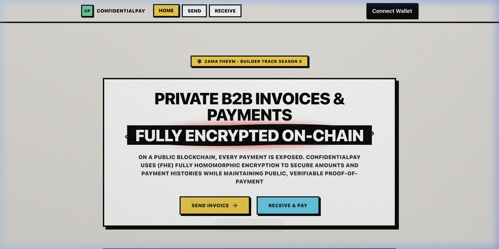

# ConfidentialPay

> Private B2B invoice and payment system powered by Fully Homomorphic Encryption on Ethereum.

🔗 **Quick Links:**
- **Live Demo:** [confidential-pay.vercel.app](https://confidential-pay.vercel.app)
- **GitHub:** [github.com/ritesh59697/ConfidentialPay](https://github.com/ritesh59697/ConfidentialPay)
- **Demo Video:** [youtu.be/26_GY-OnnS8](https://youtu.be/26_GY-OnnS8)



On a public blockchain, every payment is visible to anyone. ConfidentialPay uses Zama's FHE protocol to keep invoice amounts, payment history, and business relationships **fully encrypted on-chain** — while still allowing parties to verify that invoices have been paid.

---

## The FHE superpower: Proof of payment without revealing the amount

This is what only FHE makes possible:

```
Anyone can verify: "Invoice #42 was paid in full"
Nobody can see:    "Invoice #42 was for $47,500"
```

No zero-knowledge proof system, no TEE, no trusted oracle — just encrypted arithmetic on-chain.

---

## Features

- **Create confidential invoices** — amounts encrypted client-side before hitting the chain
- **Decrypt your own balance** — EIP-712 user-decryption via the Zama SDK (only authorized wallets can reveal)
- **Settle in cUSDT** — confidential ERC-7984 token transfers, amount never exposed
- **Cancel invoices** — sender can cancel any pending invoice
- **Proof of payment** — publicly verifiable `isInvoicePaid()` without leaking amounts
- **Dashboard views** — sender and receiver dashboards with wallet-gated decryption

---

## Architecture

```
┌─────────────────────────────────────────────────────────────┐
│  Frontend (React + @zama-fhe/relayer-sdk)                   │
│  ┌──────────────┐  ┌─────────────────────────────────────┐  │
│  │ Sender view  │  │ Receiver view                       │  │
│  │ createInvoice│  │ decryptAmount (EIP-712 Decryption)  │  │
│  │ cancelInvoice│  │ payInvoice → confidentialTransfer   │  │
│  └──────────────┘  └─────────────────────────────────────┘  │
└──────────────────────────┬──────────────────────────────────┘
                           │ viem / wagmi
┌──────────────────────────▼──────────────────────────────────┐
│  InvoiceVault.sol (Sepolia)                                  │
│  ┌──────────────────────────────────────────────────────┐   │
│  │  Invoice { euint64 amount, address sender/recipient }│   │
│  │  TFHE.allow(amount, sender)  // ACL grant            │   │
│  │  TFHE.allow(amount, recipient)                       │   │
│  └──────────────────────────────────────────────────────┘   │
└──────────────────────────┬──────────────────────────────────┘
                           │ ERC-7984
┌──────────────────────────▼──────────────────────────────────┐
│  cUSDT (Zama wrapped token — confidential ERC-20)            │
└─────────────────────────────────────────────────────────────┘
```

---

## Tech stack

| Layer | Technology |
|-------|------------|
| Smart contracts | Solidity 0.8.24 + FHEVM library |
| FHE primitives | `euint64`, `TFHE.allow()`, `TFHE.asEuint64()` |
| Frontend | React 18 + Vite + Tailwind CSS |
| FHE SDK | `@zama-fhe/relayer-sdk` (v0.4.1) |
| Wallet | wagmi v2 + RainbowKit + viem |
| Network | Ethereum Sepolia testnet |
| Deploy | Vercel |

---

## Getting started

### 1. Clone and install

```bash
git clone <your-repo>
cd confidentialpay

# Install contract dependencies
cd contracts && npm install

# Install frontend dependencies  
cd ../frontend && npm install
```

### 2. Set up environment

```bash
# In /contracts
cp .env.example .env
# Add PRIVATE_KEY, SEPOLIA_RPC_URL, ETHERSCAN_API_KEY, CUSDT_ADDRESS

# In /frontend
cp .env.example .env
# Will fill after deploying contracts
```

### 3. Compile and test contracts

```bash
cd contracts
npm run compile
npm test
```

### 4. Deploy to Sepolia

```bash
cd contracts
npm run deploy:sepolia
# Copy the deployed address into frontend/.env as VITE_INVOICE_VAULT_ADDRESS
```

### 5. Run the frontend

```bash
cd frontend
npm run dev
# Open http://localhost:5173
```

### 6. Deploy frontend to Vercel

```bash
cd frontend
npx vercel --prod
# Set environment variables in Vercel dashboard
```

---

## How FHE is used

### Encrypted storage
```solidity
struct Invoice {
    euint64 amount;  // Never decryptable on-chain — encrypted at rest
    // ...
}
```

### Client-side encryption (frontend)
```ts
// Amount is encrypted on the user's device before submission
const fhevm = await getFhevm();
const input = fhevm.createEncryptedInput(INVOICE_VAULT_ADDRESS, userAddress);
input.add64(amount);
const encrypted = await input.encrypt();
const encAmount = bytesToHex(encrypted.handles[0]);
const inputProof = bytesToHex(encrypted.inputProof);
await writeContract({ functionName: "createInvoice", args: [recipient, encAmount, inputProof, uri] });
```

### ACL-gated decryption
```solidity
// Only these wallets can call userDecrypt()
TFHE.allow(amount, msg.sender);   // invoice sender
TFHE.allow(amount, recipient);    // invoice recipient
```

### Proof of payment (no amount revealed)
```solidity
function isInvoicePaid(uint256 invoiceId) external view returns (bool) {
    return invoices[invoiceId].status == InvoiceStatus.Paid;
}
```

---

## Project structure

```
confidentialpay/
├── contracts/
│   ├── contracts/InvoiceVault.sol   # Main FHE contract
│   ├── scripts/deploy.ts            # Deployment script
│   ├── test/InvoiceVault.test.ts    # Hardhat tests
│   └── hardhat.config.ts
└── frontend/
    ├── src/
    │   ├── lib/
    │   │   ├── contracts.ts         # ABI + addresses
    │   │   ├── fhevm.ts             # Zama SDK helpers & session decryption
    │   │   └── wagmi.ts             # Wagmi & RainbowKit setup
    │   ├── hooks/
    │   │   └── useInvoice.ts        # All FHE + contract hooks
    │   ├── pages/
    │   │   ├── SenderDashboard.tsx  # Create & manage invoices
    │   │   └── ReceiverDashboard.tsx # View, decrypt & pay
    │   └── App.tsx                  # Providers + routing
    └── vite.config.ts
```

---

## Built for Zama Developer Program — Mainnet Season 3

Track: **Builder Track**  
Theme: Composable Privacy  
Network: Ethereum Sepolia / Mainnet
